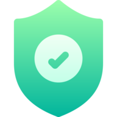

<h1 align="center">
	
	<p>SafeEncode</p>
</h1>

SafeEncode（セーフエンコード）は、セキュリティとプライバシーに焦点を当ててデータをエンコードおよびデコードするためのツールです。機密情報や個人データなどの重要なデータを安全な形式に変換し、保存や送信を行います。このツールは、セキュアな通信やデータベースでの安全なストレージなど、さまざまなセキュアなデータ処理タスクに使用できます。

# リンク

- [ドキュメント](https://safe-encode.vercel.app/docs)
- [API リファレンス](https://safe-encode.vercel.app/docs/api-reference)
- [プライバシーポリシー](https://safe-encode.vercel.app/docs/privacy-policy)

# Language
- [English](https://github.com/Fun117/SafeEncode#readme)
- 日本語

---

# ドキュメントへの貢献

ドキュメントへの貢献は簡単です。公式リポジトリを訪問して貢献してください。

# SafeEncode の始め方を学びましょう！

> [!NOTE]
> 暗号化されたコンテンツを復号化するには、暗号化に使用された同じキーを使用する必要があります。異なるキーで復号化を試みると、コンテンツが正しく復号化されない場合があります。復号化には正しいキーを使用してください。

# API リファレンス
- [暗号化エンドポイント](#暗号化エンドポイント)
- [復号化エンドポイント](#復号化エンドポイント)

## 暗号化エンドポイント

このエンドポイントは、指定されたキーを使用してコンテンツを暗号化するために使用されます。

### エンドポイント

```
GET /api/generation
```

### パラメーター

`key` (必須): 暗号化キー。

`content` (必須): 暗号化するコンテンツ。

### レスポンス

`content` : 暗号化されたコンテンツ。

### エラー

400 Bad Request: 必須のパラメーターのいずれかが欠落しているか無効です。

### 例

リクエスト

```js
fetch('http://safe-encode.vercel.app/api/generation?key=<KEY>&content=<CONTENT>')
	.then(response => response.json())
	.then(data => {
		console.log(data.content);
		if (!data.error) {
			// 成功したレスポンスをここで処理する
		}
	})
	.catch(error => {
		console.error('データの取得中にエラーが発生しました:', error);
	});
```

## 復号化エンドポイント

このエンドポイントは、指定されたキーを使用してコンテンツを復号化するために使用されます。

### エンドポイント

```
GET /api/generation
```

### パラメーター

`key` (必須): 復号化キー。

`content` (必須): 復号化するコンテンツ。

### レスポンス

`content` : 復号化されたコンテンツ。

### エラー

400 Bad Request: 必須のパラメーターのいずれかが欠落しているか無効です。

### 例

リクエスト

```js
fetch('http://safe-encode.vercel.app/api/decryption?key=<KEY>&content=<CONTENT>')
	.then(response => response.json())
	.then(data => {
		console.log(data.content);
		if (!data.error) {
			// 成功したレスポンスをここで処理する
		}
	})
	.catch(error => {
		console.error('データの取得中にエラーが発生しました:', error);
	});
```

---

# プライバシーポリシー

## 運営者情報

この機能は個人（Fun117）によって運営および開発されています。

## 収集される情報

このサービスを使用する際、API リクエストを行ったときにのみ情報が収集されます。収集された情報は、API の使用頻度を追跡するために使用されます。ただし、URL やその内容などの個々の詳細は収集されません。

## 連絡先情報

ご質問やご不明な点がある場合は、以下のメールアドレスまでお気軽にお問い合わせください。

- 運営者名: Fun117

## 変更の通知

このプライバシーポリシーは定期的に更新される場合があります。変更がある場合は、このページで通知されます。定期的に更新内容を確認してください。